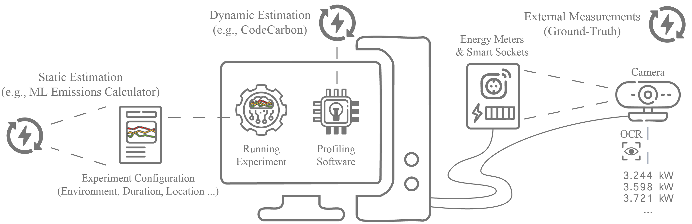

# Ground-Truthing AI Energy Consumption: Validating CodeCarbon Against External Measurements

## 📖 About

While established tools like [CodeCarbon](https://github.com/mlco2/codecarbon) and the [ML Emissions Calculator](https://github.com/mlco2/impact) facilitate the tracking of AI's environmental impacts, they rely on pragmatic assumptions that may lead to substantial inaccuracies.
This repository validates AI energy estimation tools against external measurements and accompanies the respective [research paper](https://arxiv.org/abs/2509.22092) (preprint, currently under review). 



## 🧪 Key Findings

- Established energy estimation tools can deviate up to 40% from measured energy consumption
- Despite following overall consumption trends, tools often fail to capture hardware- and workload-specific nuances
- The proposed validation procedure only requires a basic setup and can be easily extended to other AI evaluations and tools

## 📂 Repository Structure
```bash
├── experiments/        # Code for running AI experiments
├── figures/            # Result plots discussed in the paper
├── results/            # mlflow logs and ground-truth data (images and tables)
├── util/               # Utility scripts for image analysis and plotting
├── .gitignore          # gitignore
├── README.md           # You are here 🚀
└── requirements.txt    # Libraries for running experiments and analysis
```

## ⚙️ Installation

Clone the repo and install dependencies for the master environment:

```bash
git clone https://github.com/raphischer/ai-energy-validation.git
cd ai-energy-validation
conda create --name mlflow python=3.12
conda activate mlflow
pip install -r requirements.txt
```

If you want to run the *Vision* experiments, you need to acquire the [ImageNet database](https://www.image-net.org/). Download the `ILSVRC2012_img_train.tar` and `ILSVRC2012_img_val.tar` archives to some local directory, and make sure to pass the respective path as the `--datadir` when executing the experiments.

If you want to run the *Language* experiments, you need to first install [ollama](https://ollama.com/) locally.

## 🚀 Running experiments
This code base uses [mlflow](https://mlflow.org/) for streamlining the execution of experiments.
For each type of experiment (*Vision* or *Language*), a custom conda environment will be created.
This allows you to easily run single experiments, for example by executing

```bash
mlflow run -e main.py ./experiments/ollama # runs a single Ollama model for 15 minutes
```

or 
```bash
mlflow run -e main.py -P datadir=[your imagenet directory] ./experiments/imagenet # runs a single ImageNet model for two minutes
```

There are multiple hyperparameters, for example you can adjust the selected model via `-P model=ResNet50` and execution time via `-P seconds=60`. 

For running multiple experiments, you can easily create scripts based on the examples in the experiment folders. These scripts also demonstrate how you can summarize the resuls of multiple experimental runs in a `csv` file with a single command:

```bash
mlflow experiments csv -x $exp_id > "results/$exp_name.csv"
```

## ⚡ Ground-Truth Tracking & OCR
As explained in the paper, the most affordable devices for ground-truth tracking of local hardware are either smart sockets or basic energy meters.
For running the comparisons, I (co-)developed the [Lamarr Energy Tracker](https://github.com/lamarr-institute/lamarr-energy-tracker) which enables users to track ground-truth energy consumption via [Nous A1T sockets](https://nous.technology/product/a1t.html) - more information can be found in the [LET repository](https://github.com/lamarr-institute/lamarr-energy-tracker).

For performing the image analysis on webcam images of the basic energy meter, I implemented a custom [computer vision script](./util/image_analysis.py).
It allows to interactively tune the preprocessing parameters and manually label digits from the camera via the command line to create an OCR classifier.
Once trained, this script processes all camera images with minimal user input. You likely need to slightly adapt this script based on your own setup.

## Contributing & Citing
If you conduct your own ground-truth validation experiments, please reach out and let me link them here!

You can use the following reference if you want to cite my work:

```
Fischer, R. Ground-Truthing AI Energy Consumption: Validating CodeCarbon Against External Measurements. (2025) doi:10.48550/arXiv.2509.22092.
```

```bibtex
@misc{fischer2025groundtruthingaienergyconsumption,
      title={Ground-Truthing {AI} Energy Consumption: {Validating} {CodeCarbon} Against External Measurements}, 
      author={Raphael Fischer},
      year={2025},
      eprint={2509.22092},
      doi = {10.48550/arXiv.2509.22092},
      url={https://arxiv.org/abs/2509.22092}, 
}
```

Copyright (c) 2026 Raphael Fischer